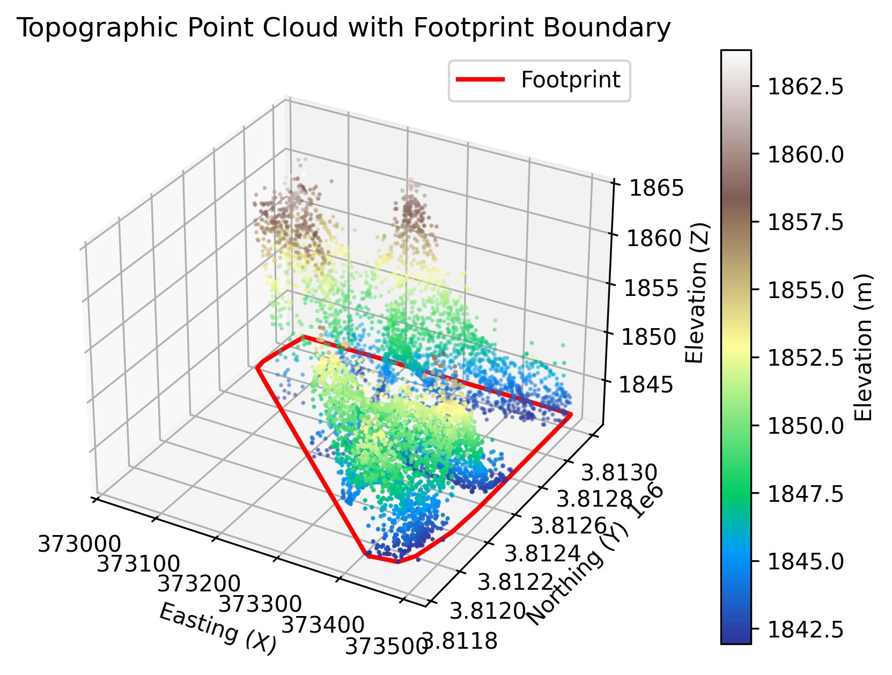
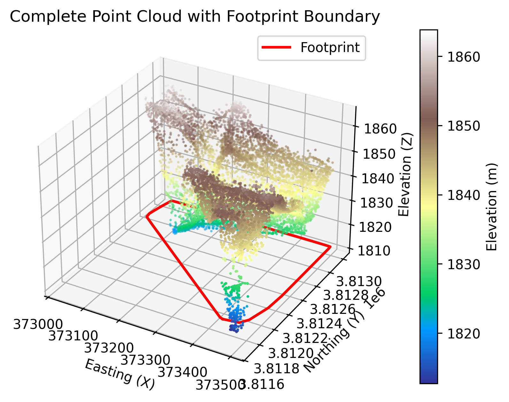

# LiDAR Point Cloud Volumetric Parser (MVP)

A simple, lightweight Python pipeline designed to parse raw LiDAR datasets (`.las`/`.laz`), isolate points above an average elevation baseline, and calculate rough surface areas and volumetric payloads.

> ℹ️
> This is a portfolio demonstration and proof of concept. It is not intended for commercial engineering, large-scale production, or high-precision survey audits.

> ⚠️
> This code is written by hand with AI assistance to understand the logic and workflow. Goal of the repository is to understand the concept and create a MVP product, using AI as the assistant. README is also written with AI assistance to optimize SEO and readability.
---

## 📊 Dataset Credit & Sourcing

The sample dataset (`las2018.laz`) used for development was sourced from the [USGS National Map Lidar Explorer](https://viewer.nationalmap.gov/basic/).
* **Format:** `.laz` (Compressed LiDAR)
* **Scale Precision:** Millimeter (0.001m precision)

To run the pipeline with your own data:
1. Download a tile in `.las` or `.laz` format from the USGS portal.
2. Save it to the working directory.
3. Update the file path in `lidar_volumetry.py`.

---

## 🤔 Why Use This?

While professional civil engineering projects typically rely on feature-rich CAD suites (like Autodesk Civil 3D or Bentley MicroStation) or GIS software (like ArcGIS Pro), this lightweight Python workflow offers key practical advantages for specific use cases:

1. **Zero Licensing Cost:** It uses free, open-source libraries (`laspy`, `numpy`, `alphashape`). Anyone can run it without purchasing expensive proprietary CAD/GIS software licenses.
2. **Speed & Low Overhead:** Heavy CAD programs can take minutes to load massive datasets and often freeze on standard laptops. This script loads, filters, and calculates volumetric data in seconds using native NumPy operations.
3. **Easy Automation & Scripting:** Because it is a simple Python script, it can easily be scheduled (e.g., cron jobs), integrated into automated file pipelines, or run in batch mode over dozens of files without manual user interface clicks.
4. **Transparency & Customizability:** All parameters (like downsampling rates and boundary concavity) are explicitly written in code. This provides a clear, reproducible calculation logic rather than a "black-box" proprietary algorithm.

---

## 📋 Sample Scenario: Stockpile Volume Auditing

### The Context
A civil engineering team is managing a highway construction project. Every week, a supplier delivers truckloads of crushed stone sub-base material, creating a large aggregate stockpile at a temporary staging yard.

### The Problem
* The supplier bills the project based on estimated truck counts, which are prone to human error and volume discrepancies (bulking/compaction).
* The team needs a fast, weekly estimation of the stockpile volume to verify supplier invoices.
* Sending a surveyor out with GPS equipment every week is costly and takes time, and processing the points manually in CAD to create surfaces takes hours of manual work.

### The Solution with this Script
1. **Data Collection:** Every Friday evening, a field tech flies a basic drone equipped with a LiDAR sensor over the stockpile yard (taking less than 10 minutes).
2. **Execution:** The tech drops the raw point cloud (`.laz` format) into the project directory and runs `python lidar_volumetry.py`.
3. **Result:** The script automatically filters out the flat staging ground, isolates the heap points, outlines the pile footprint, and estimates the stockpile volume (e.g., ~2.3M m³) in seconds. It also saves a 3D visualization to include in the weekly progress report.
4. **Value:** The project manager can instantly compare this volume against the supplier's invoiced quantity, catching discrepancies early without waiting days for formal survey reports.

---

## 🛠️ How it Works

1. **Metadata Inspection:** Reads the LAS/LAZ file header to retrieve overall coordinate bounds, scales, offsets, and total point count.
2. **Baseline Filtering:** Calculates the average elevation (`Z_avg`) across the dataset. It treats points above this baseline as the pile (high-ground) and filters out points below it.
3. **Footprint Boundary:** Uses the `alphashape` library on a downsampled set of coordinates to trace a 2D boundary footprint of the isolated pile.
4. **Volumetric Integration:** Multiplies the calculated 2D footprint area by the average height of the pile points above the baseline to estimate the volume in cubic meters ($m^3$).
5. **Visualization:** Generates and saves 3D plots showing the point cloud along with its footprint.

---

## ⚙️ Configuration & Parameters

To adjust the script for different data files, open `lidar_volumetry.py` and modify the following values:

### 1. Input File
```python
las = laspy.read("las2018.laz")  # Change to your filename
```

### 2. Downsampling Rate (for Boundary Calculation)
```python
downsampled = points_2d[::500]  # Uses every 500th point
```
* **Why it's there:** Calculating alpha shapes on millions of points is very slow. Downsampling makes it fast.
* **Tuning:** Reduce this (e.g., `[::100]`) for a more detailed boundary if the dataset is small, or increase it (e.g., `[::1000]`) for larger datasets to save memory/time.

### 3. Alpha Shape Param (Concavity)
```python
boundary = alphashape.alphashape(downsampled, alpha=0.0)
```
* `alpha=0.0` generates a convex hull (a tight bounding box).
* If your stockpile has irregular indentations, increase `alpha` slightly (e.g., `0.1` to `0.5`) to let the boundary contour closely around the shape.

---

## 🚀 Quick Start

### Prerequisites
- Python 3.13 or newer
- [uv](https://github.com/astral-sh/uv) (recommended) or `pip`

### Install & Run
1. Clone this repository.
2. Place your LAS/LAZ file in the folder.
3. Install dependencies and run:
   ```bash
   # Using uv:
   uv sync
   source .venv/bin/activate
   python lidar_volumetry.py
   
   # Or using standard pip:
   pip install -e .
   python lidar_volumetry.py
   ```

### Output Files & Visualizations

The script automatically generates and saves two 3D scatter plot visualizations of the results:

1. **`lidar_volumetry.png`**: Visualizes the filtered high-ground (stockpile) points above the baseline, with the calculated footprint boundary contour shown in red.
   
   

2. **`lidar_volumetry_complete.png`**: Visualizes the entire raw dataset (complete point cloud) to show the stockpile in its environmental context, with the footprint boundary overlaid at the base.
   
   
